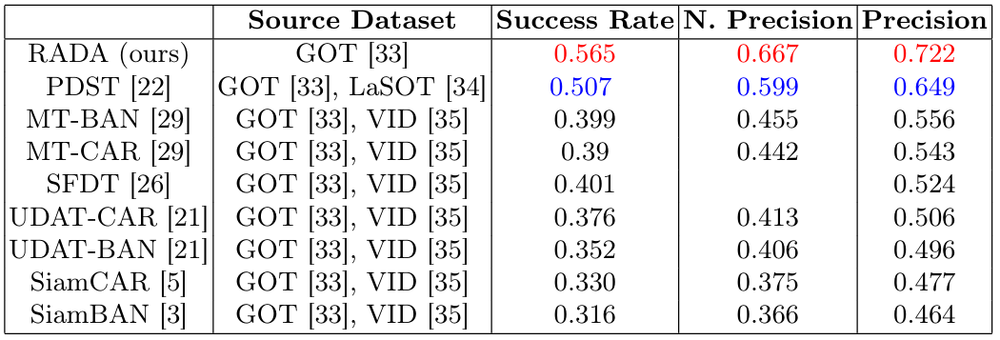

# RADA

# Results available
- [NAT](https://github.com/chouhan-avinash/RADA/blob/main/results/NAT.zip)
- [NAT_L](https://github.com/chouhan-avinash/RADA/blob/main/results/NAT_L.zip)
Trained models will be shared here 

# Numerical Results
## NAT_2021-test


## NAT_2021_L-test


## Other datasets (without adaptation)


## Citation

```
@InProceedings{10.1007/978-3-031-78192-6_21,
author="Chouhan, Avinash and Chandak, Mayank and Sur, Arijit and Chutia, Dibyajyoti and Aggarwal, Shiv Prasad",
editor="Antonacopoulos, Apostolos and Chaudhuri, Subhasis and Chellappa, Rama and Liu, Cheng-Lin and Bhattacharya, Saumik and Pal, Umapada",
title="RADA: Reconstruction Assisted Domain Adaptation for Nighttime Aerial Tracking",
booktitle="Pattern Recognition",
year="2025",
publisher="Springer Nature Switzerland",
address="Cham",
pages="315--330",
isbn="978-3-031-78192-6"
}


```
# Credits
